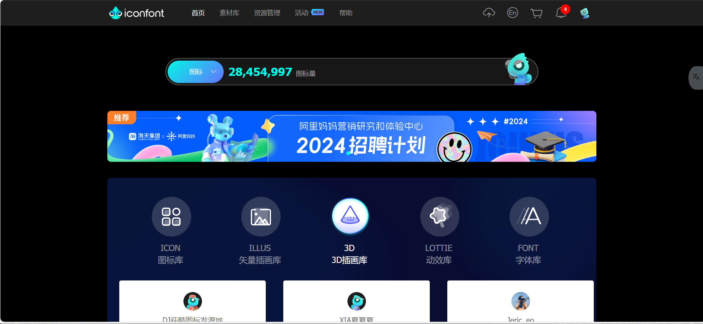

# 前端学习demo
## [echarts](public/markdown/Echarts.md)
一些基础的echarts学习，包括柱状图、折线图、柱状图折线图结合、饼图、地图、仪表盘这些常用的图形的学习  
学习网站:  
1.[Echarts图标集](https://www.isqqw.com)

2.[Apache Echarts](https://echarts.apache.org/zh/option.html#title)
  
3.[datav](https://www.yuque.com/datav-doc/zh) /  [datav vue3](https://datav-vue3.netlify.app/Guide/Guide.html)

4.[iconfont-阿里巴巴矢量图标库](https://www.iconfont.cn/)  

第一个比较常用，第二个是作为学习备用.第三个是地图引用,第四个是图标

后续会更新学习Web前端：HTML、CSS、Bootstrap、JavaScript、JQuery


## Project setup
```
npm install
```

### Compiles and hot-reloads for development
```
npm run serve
```

### Compiles and minifies for production
```
npm run build
```

### Lints and fixes files
```
npm run lint
```

### Customize configuration
See [Configuration Reference](https://cli.vuejs.org/config/).


